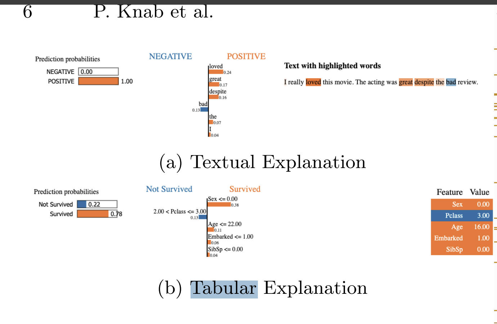

**Title:** Which LIME should I trust? Concepts,
Challenges, and Solutions

**Link:** https://arxiv.org/pdf/2503.24365

**Key Takeaways:** This paper addresses the different adaptations of LIME and provides a holistic overview of advancements in LIME.

**Abstract:** As neural networks become dominant in essential systems,
Explainable Artificial Intelligence (XAI) plays a crucial role in fostering trust and detecting potential misbehavior of opaque models. LIME
(Local Interpretable Model-agnostic Explanations) is among the most
prominent model-agnostic approaches, generating explanations by approximating the behavior of black-box models around specific instances.
Despite its popularity, LIME faces challenges related to fidelity, stability, and applicability to domain-specific problems. Numerous adaptations
and enhancements have been proposed to address these issues, but the
growing number of developments can be overwhelming, complicating efforts to navigate LIME-related research. To the best of our knowledge,
this is the first survey to comprehensively explore and collect LIME’s
foundational concepts and known limitations. We categorize and compare its various enhancements, offering a structured taxonomy based
on intermediate steps and key issues. Our analysis provides a holistic
overview of advancements in LIME, guiding future research and helping practitioners identify suitable approaches. Additionally, we provide a
continuously updated interactive website, Which LIME Should I Trust?,
offering a concise and accessible overview of the survey.

**AI Summary:** Findings: This is a survey of LIME's foundations, known limitations (fidelity, stability, domain applicability) and the many proposed enhancements. It offers a taxonomy based on LIME's intermediate steps and key issues, plus an interactive website.

Relevance: highest of the three. It's your best source for the taxonomy of LIME's problems and for which enhancements might change the cost/quality trade-off, such as changes to sampling, surrogate fitting or perturbation strategy. One caution: the idea that cost-efficiency on tabular data hasn't been studied because LIME is inefficient is your inference, not something the abstract says. The absence could just as easily reflect researchers focusing on fidelity and stability. I'd check whether the survey discusses computational cost or dimensionality explicitly, and treat the research gap as something you need to establish yourself.

**Paper's Value:** This paper poses more relevance as it discusses the computational inefficieny's of LIME and limitations in the handling of certain types of data. This paper gives insight as to why LIME'S cost-efficieny in regard to tabular data may not have been studied due to the LIME's overall inefficieny. This comes from the perspective of features changing cost/quality tradeoff.

